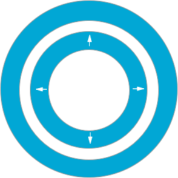
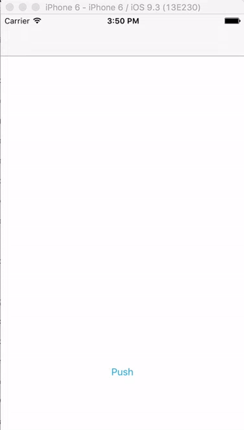

# O20HoleTransition




[](https://travis-ci.org/Tanveer/O20HoleTransition)
[](http://cocoapods.org/pods/O20HoleTransition)
[](http://cocoapods.org/pods/O20HoleTransition)
[](http://cocoapods.org/pods/O20HoleTransition)

Custom UIViewController transition to present the UIViewController.
## ScreenShot



## Detail Description

A custom UIViewController transition to show the ViewController with the closing and opening hole. More suited towards the loading screens as while the transiting is happening user will see the preview of the screen underneath it.

## Example

To run the example project, clone the repo, and the O20HoleTransition.xcworkspace from Example directory first.

## Installation

O20HoleTransition is available through [CocoaPods](http://cocoapods.org). To install
it, simply add the following line to your Podfile:

```ruby
pod "O20HoleTransition"
```

## Author

Tanveer, object2.0@gmail.com

## Thanks
Thanks to <a href="https://gist.github.com/LucasTizma">LucasTizma</a> for <a href="https://gist.github.com/LucasTizma/688aaa9bb44a2178ec44cf030c74e426">providing closure based CAAnimation methods</a>


## License

O20HoleTransition is available under the MIT license. See the LICENSE file for more info.
